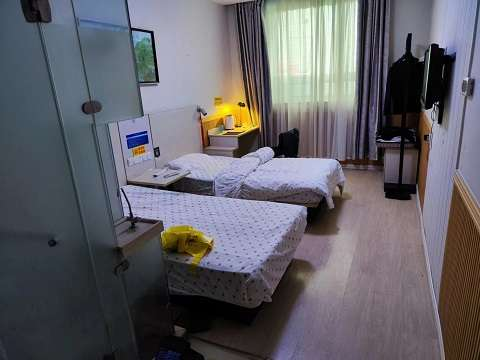

# 第二日

## 第二天了

夜晚秋雨拍窗，哗啦啦的节奏下，很快入眠。*卧迟灯灭后，睡美雨声中。* -- <strong>白居易</strong>

七点开始早餐，群里比昨天安静了很多，经过昨天的喧嚣，吃住相关的各种问题得到解决，大家也都熟悉了这种隔离生活的规则和节奏。

屋长不过九步，宽约三米，室内一桌、一椅、两张床、一洗手间而已，北面是窗户，窗外是一个楼房的后墙，相隔有两米，不过中间的夹道不像是可以走的，更可能是废水通道，所以干脆关闭了窗户，2星级的酒店，窗户更多是装饰属性的作用。

电视没开（世界杯之前也没什么可看的），非常的安静，如果不看表，防疫人员按时在门口放置三餐的声音可以用来区分一天的时间段，窗户可以判断黑夜和白天，所以我特理解电影里面犯人在牢房的墙上每天刻线的行为，因为在封闭的环境里，感知时间是我们能直接获取的外界唯一的信息，当然是在没有手机的情况下。

安静的久了，中央空调的 *huhu* 声会逐渐的让人烦躁，因为它是那种持续且琐碎、衰弱又无聊、但是低波能侵蚀脑子的声音。摆脱它的方法就是找点事情做，比如可以运动一下，两床间距半米，站在中间，正好可以双手按住两边的床帮，做上斜俯卧撑，一边运动一边脑补电影里面主角犯人为了越狱进行体能训练的画面，不过低头看到自己的大肚腩又会瞬间泄气躺倒在床上。

当然了，最好的办法是关掉它，每当室温上升到25度的时候我就关闭空调，所以一般只开半天就够了，晚上睡觉会关闭它。

## 隔离区别

今天是隔离的第二天，但是如果算上大前天之前的14天居家封控，足不出户有16天了，和这次集中隔离比起来区别还是蛮大的：

|类型|集中隔离|居家隔离|
| -- | :-- | :-- |
|隔离地点|酒店/方舱|家|
|活动范围|单间（15m2左右）| >15m2 |
|隔离人员|个人|家人|
|优点|难得独处，生活规律，省钱|难得朝夕相处，生活不规律|
|缺点|孤单，感觉像“坐牢”，生活用品未必够|抢菜、上网课、生活不规律、易吵架|
|封控强度|严格服从|门内自由|

这次隔离如果按照最新的防疫政策，应该是5+3天，也就是8天，加上之前的14天，合计22天。手机查了一下拘留的最高处罚是15天，犯罪最短刑期是一个月，我这也算体验 *生活* 了吧？

晚饭的时候看群里聊天，有人说：
> 饭都不够吃的，平时没有吃过这么好的饭。

[diary-san-can-list.md](/diary-san-can-list.md "mention")

能猜出不少人可能还蛮喜欢这种隔离生活的（两天还是新鲜期），特别是一些在家从事家务的爷爷奶奶辈的，现在吃喝有人送，还不花钱，逃离了每日的柴米油盐和无尽的家务，目前能做的事情就是躺床上看电视，且心安理得。如在平时，不去赚钱还不干点活，就和自己犯罪了一样，心虚；而现在，过着个罪犯一样的生活，心安。

## 看电影

下午实在无聊，从平板上找了部电影看，[《西线无战事》](/dian-ying-xi-xian-wu-zhan-shi.md)
