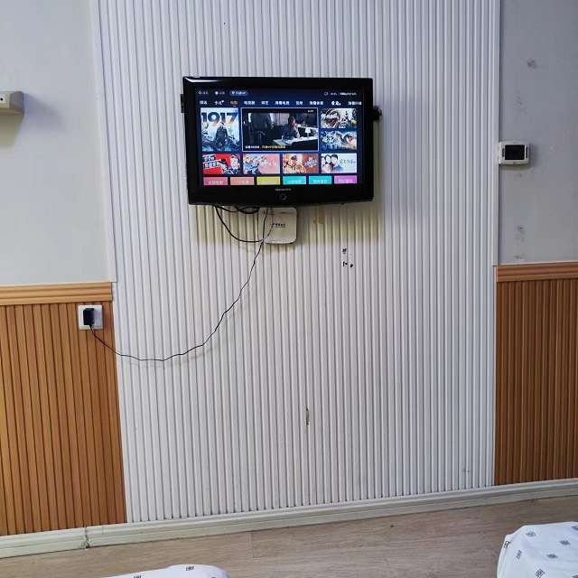

# 第五日

## 第五天了

昨天睡的晚些，早上没起来，7点放得早餐，8点我才去拿，不过并不饿。

> 因为昨天送来了电脑笔记本，就不愿意再用平板了，之前的日记全部是用apple pencil笔写在Pad上的，晚上的时候开始把前面写的日记搬运到电脑里，所以打字打到很晚。

今天是5天集中隔离的最后一天，明天很多人就可以回家了，应该有周五上班的感觉（明天过周末），我呢还得再坚持几天。

孩子这个时候应该在学校了。

一早看新闻，石家庄顶着几百人的阳性形势下，取消了全员核酸检测，并且公共场所不查健康码了，是否谣言还未知，需要再等等看看后续，结合广州的当前的YQ政策和社会情况，我觉着石家庄不亏“国际庄”的盛名，我原本以为吕布已经天下无敌了，没想到竟有人比他还勇猛。

`赵子龙是常山石家庄人`

午饭前，群管理又统计了一下留下集中隔离的房间号，我看了一下大约是28个，有近一半的的人申请留下来了，都是 **亏了我一个，幸福一家人** 的想法。

中午的时候把电视机打开了，原来是之前我选错了频道，切换到天翼高清就可以看了。但是屏幕太小，画面也模糊，很多剧要开VIP，也没啥看的兴趣。

> 现在的智能电视不同品牌不同网络服务商，操作方式也不一样，真不如以前，电视演啥我看啥，大不了换频道, 现在可好，电视节目啥都有，就是只给你看前几分钟。以前几点几分什么频道有什么节目，心里门清，自己喜欢的节目一集不会漏掉，现在坐电视前研究半天，也不知道自己到底想看个啥。

## 视频与文字

长点的电视剧更难以看下去(这点我媳妇是特例，四五十集的国产电视剧看的最起劲)，说实在的现在我看电影也感觉费劲，如果不是被封控，一年到头看不了几部电影(基本还都是在电影院看的)，抖音B站上有很多的主角是"阿美"或者"老王"的短视频：UP主3分钟带你看大片，5分钟看完一部电视剧，10分钟读完30本名著。播放量还都非常的高。


电脑程序员都不敢这么搞，最多也就是《21天带你入门Spring》《21天精通VUE》《Oracle七天从入门到放弃》，最大胆的也就敢《三天学会python》后面再跟个报课的链接。


小视频都不叫“**看**”了，叫“**刷**”，一字之差，速度感就出来了。十几年前，你要说我在看**小视频**，那得把手罩在嘴巴前小小声的说：“我有小视频，你看吗？”，生怕被其他人听到。

快节奏的社会，没有人会把时间浪费到任何没有收益的事情上，即使做有收益的事情上也是一样，我们吃的是快餐，刷更短的视频，也尽可能快的赚钱，但是结果并没有多大的变化，看手机刷视频的时间反而越来越长，钱赚比以前快了但是花的更快，到头来我们的知识没有变得更多，钱包也没有变的更鼓。

我能坐在这里写字，也是赶上了被隔离的缘故，否则正经人谁写日记啊？

<figure></figure>

前面说了，我现在正在将Pad上的内容通过电脑搬运到网络上，需要把之前写的日记重新誊录一遍，写了上万字了，期间歇会刷刷手机，越写越觉着写文章这事就是用算盘记账牛拉犁，正月初一卖门神，过时了，这个时代不属于文字。

<figure><figcaption>
我的时代已经结束，作为旧时代的残党
</figcaption></figure>

不再整理每日菜谱了！每天几乎都差不多。

***

单独写了一篇 [xie-zuo-he-duan-shi-pin-de-qu-bie.md](che-dan/xie-zuo-he-duan-shi-pin-de-qu-bie.md "mention")
