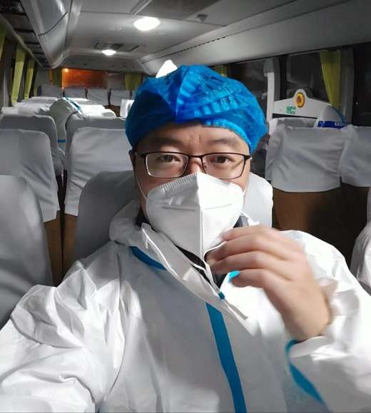
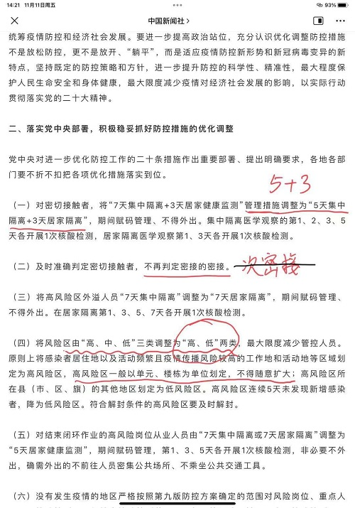

# 第一日

### 通知隔离

当我做在转运大巴车上的时候，还觉着有点太意外了吧？

电话是凌晨快一点的时候打来的，第一个电话告知我已被检测完是密接人员，1:20的时候又一个电话通知我准备准备，收拾下东西，一会出小区。

喊老婆起床，告诉她我要隔离区了，她惊讶的表情“真哩啊？”，大概率我中奖也会是这句话。看到手机微信是慧姐发给我，11点多的时候就告知我是密接了（慧姐一直是防疫一线人员），先不管了，收拾行李箱，家里还有半管牙膏，先我拿着了，白天还和老婆吵架来，这回好了，她居家隔离，我拉走集中隔离去。

2:10下楼，单元门口里面的地上放着一套白色的防疫隔离服，自己穿上，走到门口上大巴车。前段时间，我还不止一次的看着楼下忙碌的大白，说自己羡慕要有一件穿上，是不是也可以下楼了？这不？我的梦想实现了，在**双十一**这天，还送上门服务。

身上这身包裹严实的大白服，已经说明我真要去被隔离了。

<figure><figcaption></figcaption></figure>

在车上最难熬的是等待，等待发车，人陆陆续续的上车，每个人都挺惊讶的，怎么回事？不是刚解封两天吗？也有很放松的，因为那人是两天前刚放回来的上批隔离人员。大部分时间里大家都在讨论是如何被密接的？最后发现大多数人昨天做核酸都是在物业办公室检测的，当时三条核酸队伍，两边是核酸小屋，中间人最少的是物业办公室，有个别是超市密接的。

差不多等了两个小时，4点多的时候车辆发动，载着大约28人直奔隔离点 -- 乐途酒店(富居南边)。

### 入住酒店

大约4:30到达，开始依次下车，每名成人必须一人一单，14岁以下儿童可带一名监护人，工作人员确认姓名然后分配房间，我住的是170。



1. 扫码进微信群 “_乐途隔离点隔离人员群_”；
2. 发核酸绿码图（显示身份证号）；
3. 每日9点 15点在群里报送自测体温；
4. 未得通知，不得出门；
5. 每日0点前做一次核酸检测；



然后先是做一次核酸检测，口腔+鼻孔的。然后我大致看了下这个房间(未来至少一周要住在这里了)，也就2星的水准，地板有点翘缝，窗户周围有墙皮鼓起脱落，可能是纱窗开着外面有雨犯潮了，双床间，没有洗浴用品，幸好自己带了，还看到两只飞着的苍蝇。

微信群里有79人，各种反馈问题的，少枕头的，没带卫生纸的等等，没细看，赶紧发完核酸截图，5:30的时候倒头就睡着了。

### 第一天

迷迷糊糊的，感觉一直在做梦，但是记不住什么梦，隐隐约约听到走廊里好像是送饭的声音，看了眼手机7点钟。

8点半我起来，群里很多人已经吃完早饭了，我赶紧开门从门口傍边的小凳子上拿来早饭吃，开门的时候报警响了。早饭是一碗白汤，不过已经凉了，两个豆沙包也是凉的，还有一片夹心面包，早餐我就吃了一片面包。

上午给慧姐回复了微信，也确认了我的密接路径是因为和阳性混管了，姐姐也是从上次疫情开始，一直没有回过家，这波疫情又接上了。

给老婆打电话汇报汇报情况，也给爸爸、弟弟，通知了被隔离的消息。建哥听说也打电话来慰问。

当然不会忘记在微信上给朋友分享了一下这个令他们“振奋欢欣”的大好消息。

11点半，按时送饭上门，快餐盒饭，三荤，还不错，就是量有点不够，群里有人要馒头的，答应下次给加。

1点睡了1小时午觉，起来看新闻，有一个好消息，中央今天对防疫工作重新部署，7+3改成5+3了，也就是我这次隔离可能是5天。希望快点执行！

<figure><figcaption></figcaption></figure>

15点的时候，用桌子上的水银温度计量了体温，发到群里：36.1°

有个电视，但是我打开一直显示没信号，加载不出来，看群里也有人反馈的，不过算了，我也没打算看。

下午4:50，晚饭送到，多了一个馒头，这次能吃饱了。

弟弟又来电话。然后有点困了，定时1.5小时，补了个觉。

晚上8点多，试了试淋浴，一直没有热水，看群里管理人员说8点半之后才有，特意等到8:40，放了大约十分钟，水开始变热，洗了个澡，终于清醒了很多。

因为要等着12点做核酸检测，不能早睡，但是越等，感觉越饿，躺床上看会书，尽量不必要的消耗。

11:35，做核酸的大白来了，赶紧睡觉，这一天算是结束了。
