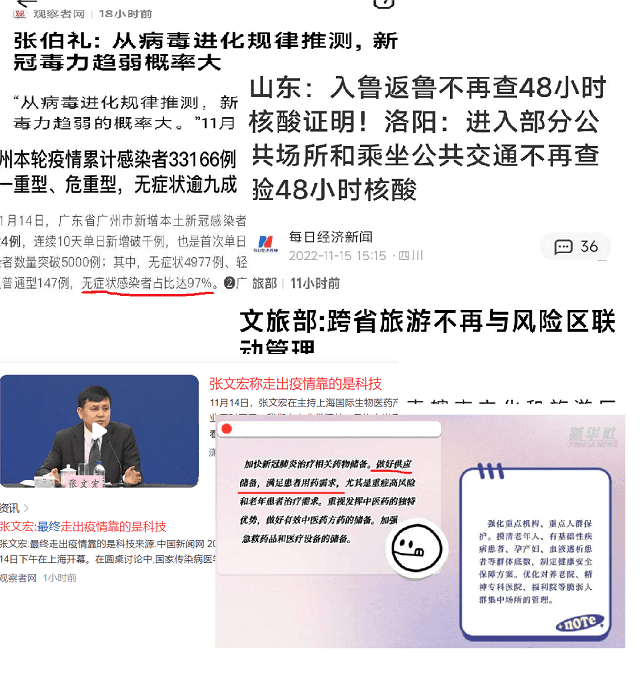
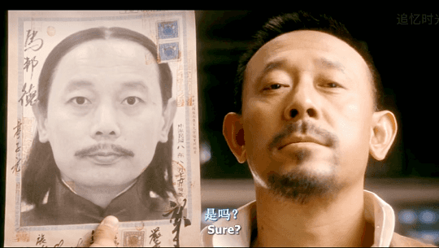

# 第六日

## 有回家的

开始睡不着觉了，醒的早但是不愿意起，可是我只睡了4个小时啊？

从昨天开始，饭一吃就饱，早餐只能吃一半，今天甚至午饭都吃不下去了，看见盒饭一点食欲没有。

10点多的时候，已经有居家隔离的人，开始准备离开了，一起来一个邻居(姑且算是吧，同小区的)，问我一起走吗？我告诉他：我还得等等，祝贺你今日出去！

走之前，每人再发一套隔离服，然后由街道社区的人拉回家。

刷手机视频刷的头疼，看书又看不进去。属实难熬。

看新闻，全国各地防控政策开始按照 _**二十条**_ 执行，舆论风向也朝着病毒威力趋弱，做好用药供应，不再查验核酸的方向宣传。这是个好兆头！



```
我们政策措施的执行，一向都是：
治大国如烹小鲜
随风潜入夜，润物细无声
民可使由之，不可使知之
```

我猜想着，外面世界是不是已经都恢复如初了？大家忙碌着各自的生活、工作和学习，忘却了昨日疫情的影响，而单单留下我还独自在最后的这点疫情尾巴里面继续煎熬，想到这，更忿忿不平了。

## 写不出来了

在这里每天过的都一样，**固定的时间发生同样的事，固定的事发生在同样的时间**。实在是没什么可以说的了。虽然是疫情隔离日记，但是又和疫情无关，每天看到的只有自己，自己目前来看还很健康，可能脑子有点问题，否则不会自言自语叨唠了这么多天。咱也写不出很多人关心的感染新冠或者和防疫相关方面的东西，无聊打发时间而已。

```
- 这日记是隔离日记吗？
-> 是啊！
- 是吗？
-> 是啊！那时候，我确实隔离了。
- 这就不是隔离日记。
-> 你说这不是隔离日记？
- 不是。
-> 我说它也不是隔离日记，这根本就他妈不是隔离日记！
- 这到底是怎么回事？
-> 我还想知道怎么回事？在家看着电视睡着觉，突然就打电话来了，告诉我隔离了，
然后管在这间小屋子里，啥也干不了，那我就写，继续关着，我继续写，然后就有了这个日记了。
```



### 解除隔离

晚上19:30，群里发来了特大喜讯!!!!

> @所有人 接指挥部通知，明天涉\*\*集中隔离人员全部解除隔离，等中午出核酸结果、镇街指挥部来接后解除隔离，解除隔离后不再居家隔离！大家明日等待通知即可。明天解除时把垃圾放在门外，不要关房门！

群里一片欢欣鼓舞啊，隔离的生活终于要结束了！

