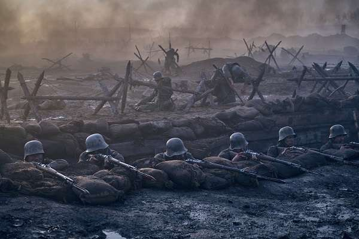
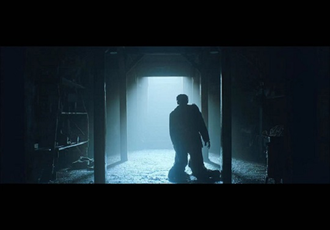
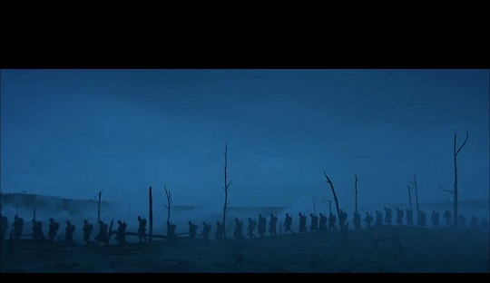

# 电影<西线无战事>

第二天下午，从网上找电影看，最新上映的且评分比较高的，就发现了这部《西线无战事》，直到写这篇文章的时候一直认为是~~**西部**~~无战事。

很容易让人联想到我们西边发生的俄乌战争，希望无论西边还是东边都没有战事发生。


网上资源贴在这里


分高的战争片，一般都是反战片，这部也是。影片一上来就是狼窝里的小狼被枪声惊醒，然后画面转到尸横遍野的战场，激烈的战斗，血肉横飞，不断倒下去的士兵，战斗的最后，死掉的人就地处理，唯一有用的是衣服，扒下来再运到后方，继续给新兵去穿。杜甫有诗为证：

> 边庭流血成海水，武皇开边意未已。
>
> ...
>
> 君不见，青海头，_古来白骨无人收。_
>
> 新鬼烦冤旧鬼哭，天阴雨湿声啾啾！

<figure><figcaption></figcaption></figure>

这个时候保罗成为了一名光荣的新兵，这批充满热血的士兵即将前往战场，紧张的肃穆的配乐加上有节奏的长号声，立马悲壮感就上来了。

懵懂无知的新兵蛋子们，燃烧着荷尔蒙的热血很快就被战争的冷雨浇了个透凉，随着战争的进行，好友一个个的死去，死的是那么的突然和随机，幸运的保罗活下来了，成为了一名合格的战士，和班长“老王”建立了深厚的友谊(一起偷鸡摸狗)，一直盼着回家的老王最后死在了一个农民孩子的枪下，而那天是就要回家的前一天。影片最后大胡子司令为了自己的面子发动了停战前最后十五分钟的突袭，已经厌倦战争的保罗不得不继续战斗，这是最后一次战斗，幸运女神没有眷顾保罗，在距离和平的到来还有一分钟的时候他死去了。

<figure><figcaption></figcaption></figure>

有道是：_<mark style="color:blue;">醉卧沙场君莫笑，古来征战几人回</mark>_，战争就像巨大的绞肉机一样，吞噬了无数生命，_<mark style="color:blue;">将军百战死，壮士十年归</mark>_，可是_<mark style="color:blue;">君问归期未有期</mark>_，最终_<mark style="color:blue;">万里长征人未还</mark>_。

天地不仁，以万物为刍狗，战争上鲜活的生命陨落，哪有什么光荣的战死？无不是倒在了泥泞中、倒在了弹坑里、倒在了回家的路上。战场中无数个个体的死亡都是那么的无助和不堪。

<figure><figcaption></figcaption></figure>

_<mark style="color:blue;">可怜无定河边骨，犹似春闺梦中人</mark>_。所谓_<mark style="color:blue;">马革裹尸何须还</mark>_，因为_<mark style="color:blue;">一将功成万骨枯</mark>_。

**愿永远没有战争！**
