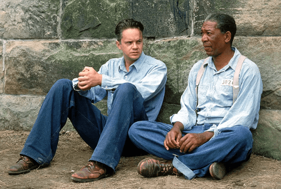

# 电影<肖申克的救赎>

这是第三天专门找来看的一部电影，上次看差不多是上学的时候了，嘚(dei)十五六年了。

我想着看这个可能比较应景，毕竟我现在的处境和坐牢有些相像，想来重看肯定会有更深刻的感悟。

其实不然，首先我一直以为主角是叫肖申克，没想到人家叫安迪，肖申克是监狱的名字，另外摩根弗里曼那个时候看着还不太老。

看完之后并没看出更多的意义，什么救赎啊，什么希望啊，什么感同身受啊。一来咱这就是一个隔离，和人家没法比，二来因为主角安迪这人设太强大(除了家庭)，这电影都不该叫什么《肖申克的救赎》，应该是《重生我到监狱打通关》《穿越之越狱龙王》。

剧中主角基本符合中国穿越玄幻类小说的套路，都是身世牛逼，不是天尊就是龙王，然后虎落平阳，但身傍奇物异宠，或者有神人暗中辅佐，一路扮猪吃虎，待到时机成熟，一招制敌，显露至尊身份，惊煞众人，最后飘然而去，留下万古传说。

再看安迪此人，身高马大，一看就是根骨不凡，以银行高管精英人士的身份，被诬陷，坠入监狱，你想啊40年代的监狱，里面能上过小学的人恐怕都不多，什么叫降维打击？这就是了，爽剧的开头。

先入新手村，遭遇狱警长官立威，了解到这个位面的丛林法则，开始的时候天天被几个基佬欺负挨揍，落魄不堪。

但是幸好结识了此位面上的金手指-老摩。可以搞到任何想要的东西，至此主角开始开挂，先是通过自己的税务知识帮助狱警减税，立马成了监狱里面的红人，欺负他的基佬直接被狱警打残了。很快监狱长Boss就安排他去做图书管理员，并顺便帮自己报税洗黑钱。

老摩也帮他搞来了小锤子和美女海报，与此同时安迪也开始了自己的惊天越狱计划。

安迪先是利用自己的毅力和组织规划能力，将图书馆进行了改造和扩建，并提供教学学习，相当于开宗立派了。期间和监狱长进行了几次交手，显然强龙压不过地头蛇，均已失败告终，但是峥嵘初露。他在给监狱长做假账洗钱的时候，暗动手脚，打造了一个后来作为自己“飞升”穿回去的虚构人物。

在被Boss杀了自己一个跟班之后，安迪终于决心要重回巅峰，拿回本该属于自己的东西。

<figure><figcaption></figcaption></figure>

原来这20年来安迪一直在海报的掩护下用小锤子不懈的挖掘，并最终成功越出监狱，变成了自己多年来虚构的现实人物，然后对Boss和狱警长官的犯罪活动予以揭发，而Boss的钱也顺利的收入自己囊中。至此主角一雪前耻，重夺“龙王至尊”的地位，在监狱众生中留下了不灭传说。

<figure><figcaption>
重获新生
</figcaption></figure>

当然最后不忘点拨提拔一下老摩，收回自己身边，

全剧终！

***
#### 经典句子：

> 监狱的围墙有点滑稽：首先你恨它们，然后你习惯它们，等足够的时间过去之后，你会依赖它们。这就是体制化。
>
> 在这个世界上，有些东西用石头是刻不来的。在我们的心中有块地方是关不住的，那块地方称为希望。
>
> 要么忙着活，要么忙着死。

<figure><figcaption></figcaption></figure>

