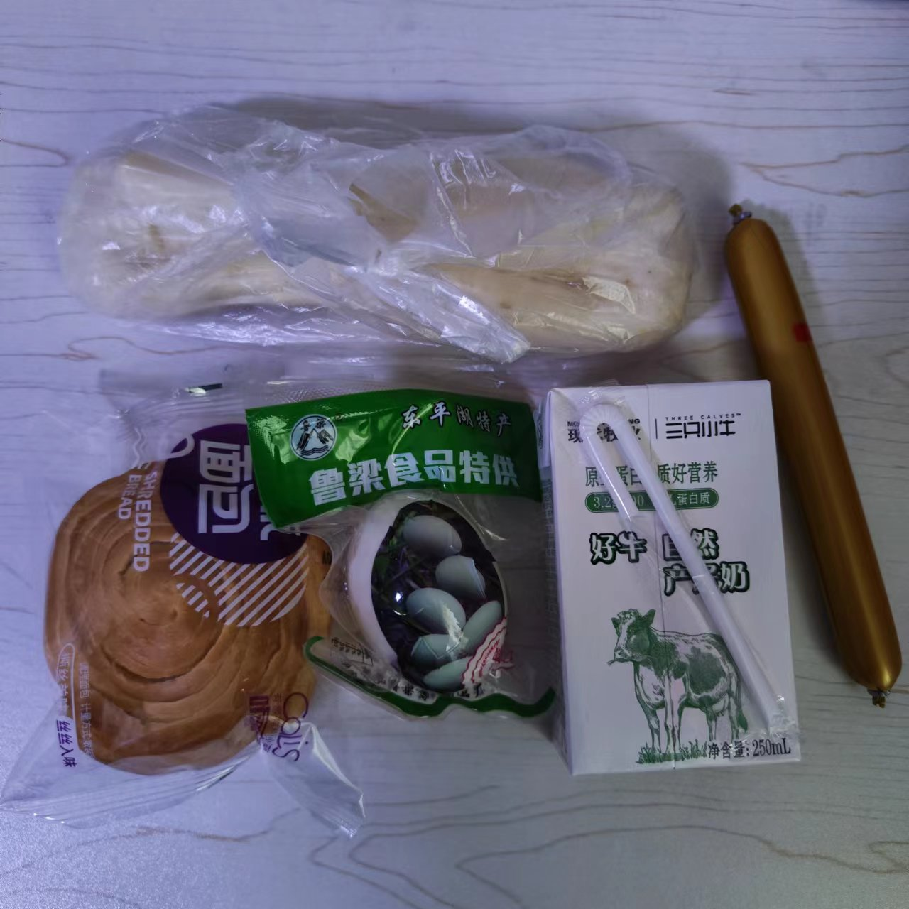

# 1-4日餐单

| 日期         |  三餐 | 时间    |                  照片                 |
| ---------- | :-: | ----- | :---------------------------------: |
| **11月11日** |  早餐 | 7:00  |                ~~没拍~~               |
| **11月11日** |  午餐 | 11:30 |    |
| **11月11日** |  晚餐 | 16:50 |    |
| **11月12日** |  早餐 | 7:00  |    |
| **11月12日** |  午餐 | 11:30 |    |
| **11月12日** |  晚餐 | 16:50 |    |
| **11月13日** |  早餐 | 7:00  | \\ |
| **11月13日** |  午餐 | 11:30 |    |
| **11月13日** |  晚餐 | 16:50 |    |
| **11月14日** |  早餐 | 7:10  |           |
| **11月14日** |  午餐 | 11:50 |           |
| **11月14日** |  晚餐 | 17:06 |           |

五日 六日餐饮大同小异，不在列了。
