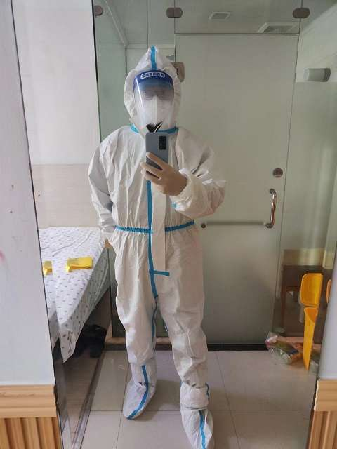

# 第七日-结束

## 收拾行李

昨天晚上11点半，继续做核酸，不过不捅鼻孔了，只简单的做了口腔，另外防疫人员对室内环境也进行了采样，门把手、水龙头开关及地面都用棉棒擦拭后采样。

7点半，早上起来最主要的事情就是收拾行李，把床也铺了铺，所有的东西都归置原位，并且刮了胡子，静候通知...

六(点5)个日夜的的隔离，虽自由受限，但也得闲适，虽孤单焦虑，但独处自省，难得的人生体验，经验值+1。

微信群里大家已经翘首以待了，有人昨晚兴奋的就没怎么睡觉，现在困的不行。

11点的送来了午饭(这是最后一顿饭了)，顺带也把成套的防疫服也放在门口了，又要穿这这个衣服了，群里有人说看见这个衣服就害怕，甚至有人说刚来的那两天，因为心情紧张还得了两天病。

吃完饭，东西也都收拾完了，静候通知...

## 出来了

快12点的时候，群里通知，准备穿上防护服，出来排队。

**今天已经没什么写的了，走了，希望再也不来了！！！**

<figure><figcaption>
准备离开
</figcaption></figure>

